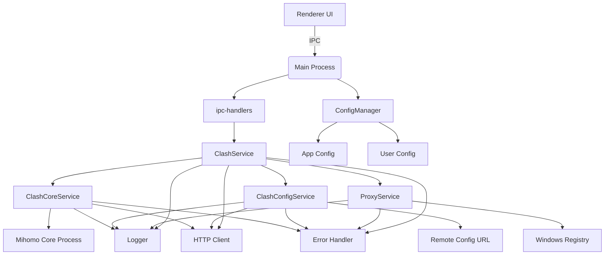

# Catalyst 系统架构

## 模块划分

Catalyst 项目采用模块化设计，主要分为以下几个核心模块：

### 1. Main (主进程)
位于 `src/main/` 目录，负责管理应用的生命周期、窗口创建、系统级操作以及与渲染进程的通信。

**核心职责**：
- 应用初始化和生命周期管理
- 创建和管理主窗口
- 处理系统级事件（如最小化、最大化、关闭）
- 作为主控中心协调各服务模块
- 通过 IPC (Inter-Process Communication) 与渲染进程通信

**关键文件**：
- [`src/main/index.js`](../src/main/index.js:42)：应用入口点，初始化服务和设置 IPC 事件监听器。
- [`src/main/window.js`](../src/main/window.js:5)：负责创建和配置主窗口。

### 2. Renderer (渲染进程)
位于 `src/renderer/` 目录，负责用户界面的展示和用户交互。

**核心职责**：
- 渲染用户界面
- 处理用户输入和交互
- 通过 IPC 向主进程发送请求
- 接收主进程的响应并更新 UI

**关键文件**：
- [`src/renderer/index.html`](../src/renderer/index.html:21)：应用的 HTML 结构。
- [`src/renderer/index.js`](../src/renderer/index.js:13)：渲染进程的入口，初始化 UI 组件。
- [`src/renderer/components/`](../src/renderer/components/)：包含各个功能组件。

### 3. Shared (共享模块)
位于 `src/shared/` 目录，包含主进程和渲染进程共享的配置和数据。

**核心职责**：
- 存放共享的配置文件
- 提供跨进程的常量和配置

**关键文件**：
- [`src/shared/config/app-config.js`](../src/shared/config/app-config.js:3)：应用级配置，如代理设置、窗口配置等。
- [`src/shared/clash_config/config.json`](../src/shared/clash_config/config.json)：Clash 配置模板。

## 核心服务

### 1. Clash Core Service
- **文件**：[`src/main/services/clash/clash-core-service.js`](../src/main/services/clash/clash-core-service.js:8)
- **职责**：
  - 管理 Mihomo (Clash) 核心的生命周期
  - 检查、下载和启动 Clash 核心
  - 提供 `startMihomo` 和 `stopMihomo` 方法
- **交互**：
  - 被 `ClashService` 调用以启动/停止核心
  - 通过 `spawn` 创建子进程运行 Clash
  - 使用 `src/main/utils/http-client.js` 进行HTTP下载
  - 使用 `src/main/utils/logger.js` 和 `src/main/utils/error-handler.js` 进行日志记录和错误处理

### 2. Clash Config Service
- **文件**：[`src/main/services/clash/clash-config-service.js`](../src/main/services/clash/clash-config-service.js:7)
- **职责**：
  - 管理 Clash 配置文件
  - 从远程 URL 下载配置
  - 加载和保存本地配置
  - 维护配置文件的版本和路径
- **交互**：
  - 被 `ClashService` 调用以获取当前配置
  - 使用 `src/main/utils/http-client.js` 进行HTTP下载
  - 使用 `src/main/utils/logger.js` 和 `src/main/utils/error-handler.js` 进行日志记录和错误处理

### 3. Clash Service
- **文件**：[`src/main/services/clash/clash-service.js`](../src/main/services/clash/clash-service.js:12)
- **职责**：
  - 作为 Clash 功能的总控制器
  - 协调 `ClashCoreService` 和 `ClashConfigService`
  - 提供代理列表、切换代理、测试延迟等高级功能
  - 通过 HTTP API 与运行中的 Clash 核心交互
- **交互**：
  - 被 `src/main/ipc-handlers/clash-ipc.js` 的 IPC 事件处理器调用
  - 调用 `ClashCoreService` 和 `ClashConfigService`
  - 通过 `src/main/utils/http-client.js` 与 Clash 的外部控制器 API 通信
  - 使用 `src/main/utils/logger.js` 和 `src/main/utils/error-handler.js` 进行日志记录和错误处理

### 4. Config Manager
- **文件**：[`src/main/services/config-manager.js`](../src/main/services/config-manager.js:8)
- **职责**：
  - 统一管理应用和用户配置
  - 提供配置的加载、合并、持久化和版本管理
  - 管理配置源（URL列表）和下载远程配置
  - 作为应用的单一配置入口点
- **交互**：
  - 被 `src/main/index.js` 在应用启动时调用以加载配置
  - 为 `ClashService` 提供配置信息
  - 使用 `src/main/utils/http-client.js` 进行HTTP下载
  - 使用 `src/main/utils/logger.js` 和 `src/main/utils/error-handler.js` 进行日志记录和错误处理

### 5. Proxy Service
- **文件**：[`src/main/services/clash/proxy-service.js`](../src/main/services/clash/proxy-service.js:4) 和 [`src/main/services/clash/proxy-setting.js`](../src/main/services/clash/proxy-setting.js:4)
- **职责**：
  - 管理系统代理设置
  - 通过 Windows 注册表修改代理配置
  - 提供 `setSystemProxy` 和 `clearSystemProxy` 方法
- **交互**：
  - 被 `ClashService` 调用，在启动/停止时设置/清除系统代理
  - 使用 `winreg` 库操作注册表
  - 使用 `src/main/utils/logger.js` 和 `src/main/utils/error-handler.js` 进行日志记录和错误处理

### 6. Utils (工具模块)
位于 `src/main/utils/` 目录，提供跨服务的通用功能。

**核心职责**：
- **日志记录**：`src/main/utils/logger.js` 提供结构化的日志记录，支持控制台输出和文件写入，区分日志级别（debug, info, warn, error）。
- **HTTP客户端**：`src/main/utils/http-client.js` 提供配置化的HTTP客户端，支持拦截器和错误处理，用于所有HTTP请求。
- **错误处理**：`src/main/utils/error-handler.js` 提供标准化的错误对象创建、全局错误处理和异步错误包装器。

### 7. IPC Handlers (IPC处理器)
位于 `src/main/ipc-handlers/` 目录，负责处理来自渲染进程的IPC请求。

**核心职责**：
- **类型安全**：使用 `ipcMain.handle` 模式，提供更清晰的请求-响应语义。
- **错误隔离**：每个处理器都有独立的错误处理逻辑，防止一个请求的错误影响其他请求。
- **日志记录**：记录所有IPC请求和响应，便于调试。

## 服务交互关系

**交互流程示例 - 启动 Clash**：
1. 用户在 UI 上点击“启动Clash”按钮
2. `ClashPanel` 组件通过 `ipcRenderer.invoke('start-clash')` 发送请求
3. `src/main/ipc-handlers/clash-ipc.js` 的处理器接收到请求
4. 调用 `ClashService` 的 `startMihomo` 方法
5. `ClashService`：
   - 调用 `ConfigManager` 确保配置已加载
   - 调用 `ClashCoreService.checkAndDownloadCore()` 确保核心存在
   - 调用 `ClashCoreService.startMihomo(configPath)` 启动核心
   - 调用 `ProxyService.setSystemProxy()` 设置系统代理
6. `ClashCoreService` 使用 `child_process.spawn` 启动 Mihomo 核心进程
7. `ProxyService` 通过 `winreg` 修改 Windows 注册表设置代理
8. `ipc-handlers` 将成功/失败状态返回给渲染进程
9. `ClashPanel` 组件更新 UI 显示“运行中”或错误信息

## 架构特点
- **分层清晰**：主进程负责业务逻辑和系统操作，渲染进程负责 UI，职责分离。
- **服务化设计**：将不同功能拆分为独立的服务，提高代码的可维护性和可测试性。
- **IPC 通信**：主进程和渲染进程通过 Electron 的 IPC 机制进行安全通信，采用 `handle/invoke` 模式提高类型安全性。
- **配置驱动**：大量使用配置文件来管理应用行为，便于定制和扩展。
- **统一工具**：引入 `utils` 模块，将公共逻辑（HTTP、日志、错误处理）提取到工具函数中，减少代码重复。
- **单一配置入口**：`ConfigManager` 作为应用的单一配置入口点，解决了 `ClashConfigService` 和 `ConfigManager` 的功能重叠问题。
- **结构化日志**：所有核心服务使用统一的日志系统，支持文件持久化，便于生产环境的问题排查。
- **模块化IPC**：将IPC处理器移至独立的 `ipc-handlers` 目录，使 `src/main/index.js` 更加简洁，职责更明确。

## 潜在改进点
- 考虑为 `ConfigManager` 添加配置版本管理和迁移机制。
- 为 `src/main/utils/http-client.js` 添加请求重试机制。
- 为 `src/main/utils/logger.js` 添加日志文件轮转（rotation）功能。
- 为 `ClashService` 添加更精细的健康检查和状态报告。
- 为 `src/main/ipc-handlers` 添加请求验证和速率限制。
