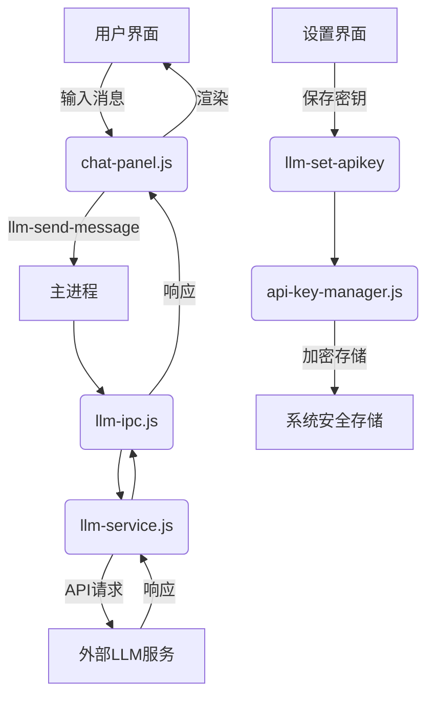

# LLM对话功能架构设计

## 1. 功能概述
实现安全的LLM对话功能，包括：
- API密钥的安全存储与管理
- 用户消息的发送与响应处理
- 实时对话渲染

## 2. 架构图


## 3. 核心组件

### 3.1 前端组件 (chat-panel.js)
- 消息输入框
- 对话历史展示区
- 连接状态指示器

### 3.2 IPC接口
| 事件名称          | 方向       | 参数               | 返回值              |
|-------------------|------------|--------------------|---------------------|
| llm-set-apikey    | 渲染→主进程| encryptedKey:string| {success: boolean} |
| llm-send-message  | 渲染→主进程| message: string    | {text: string}     |

### 3.3 服务层
**llm-service.js**
```javascript
class LLMService {
  constructor(apiKeyManager) {
    this.apiKeyManager = apiKeyManager;
  }
  
  async sendMessage(message) {
    const apiKey = await this.apiKeyManager.getKey();
    // 调用LLM API并返回结果
  }
}
```

**api-key-manager.js**
```javascript
const { safeStorage } = require('electron');

class APIKeyManager {
  async saveKey(encryptedKey) {
    const decrypted = safeStorage.decryptString(
      Buffer.from(encryptedKey, 'base64')
    );
    // 存储到安全存储区
  }
  
  async getKey() {
    // 从安全存储获取密钥
  }
}
```

## 4. 安全设计
- 使用`electron-safe-storage`加密API密钥
- 密钥以加密形式传输（渲染进程→主进程）
- 密钥明文仅存在于主进程内存中

## 5. 文件路径
- `src/main/ipc-handlers/llm-ipc.js`
- `src/main/services/llm/llm-service.js`
- `src/main/services/llm/api-key-manager.js`
- `src/renderer/components/chat-panel.js`