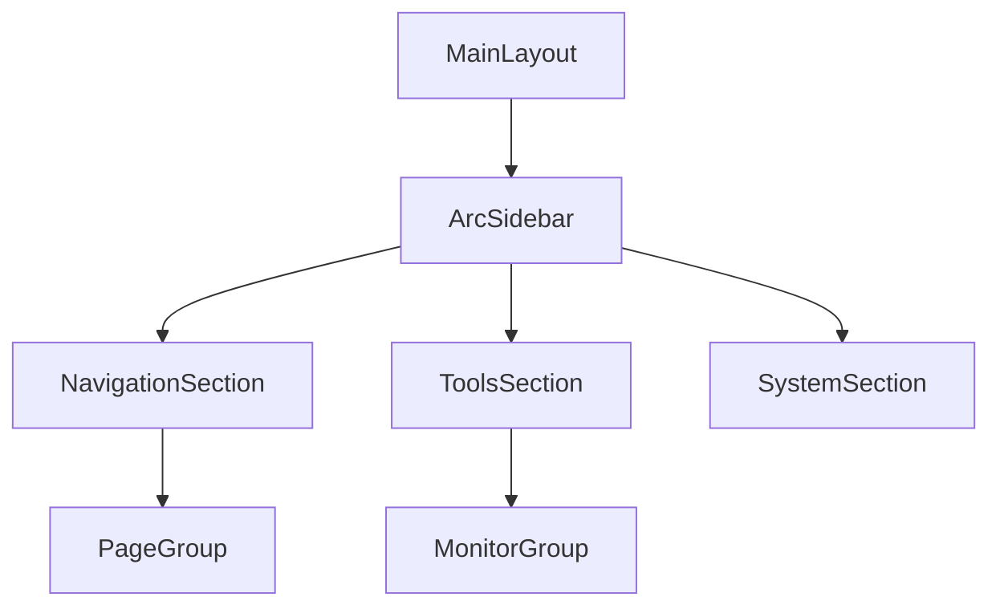

# Arc风格侧边栏架构设计

## 设计目标
- 实现现代化动态侧边栏
- 保持与现有IPC通信兼容
- 遵循项目样式规范（STYLE_GUIDE.md）

## 组件结构

## 核心特性
1. **动态折叠**：
   - 默认紧凑模式（仅显示图标）
   - 悬停延时展开（300ms过渡动画）
   - 记忆用户偏好（localStorage存储状态）

2. **视觉设计**：
   - 磨砂玻璃效果（`backdrop-filter: blur(10px)`）
   - 圆形按钮 + 悬停缩放动效
   - 活动页面高亮指示（彩色底部边框）

3. **功能区划分**：
   - 导航区（主页/聊天/设置）
   - 工具区（资源监控/软件安装）
   - 系统区（用户设置/主题切换）

## 实现方案
- 新建`src/renderer/layouts/ArcSidebar.js`
- 重构`MainLayout.js`适配新侧边栏
- 添加`src/renderer/stores/sidebar-state.js`状态管理
- 遵循CSS变量规范（使用`var(--spacing-*)`等）

## IPC集成
- 新增`toggle-sidebar` IPC通道
- 主进程处理窗口大小调整逻辑
- 渲染进程发送侧边栏状态变更事件