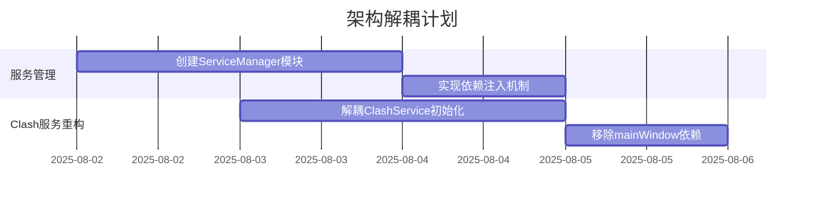
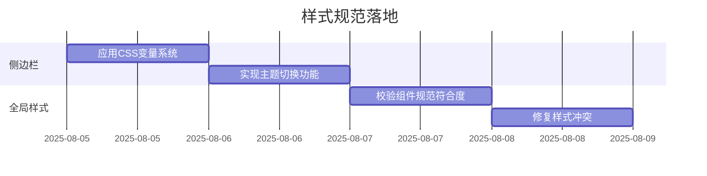
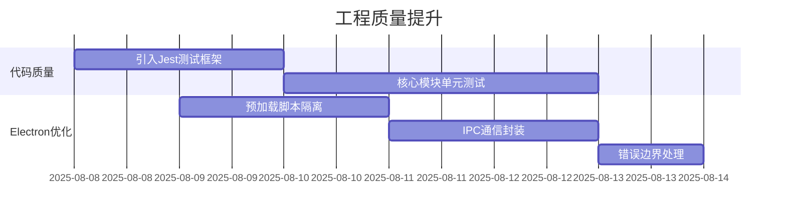

# 代码优化路线图

## 阶段一：架构解耦（预计：5人日）

## 阶段二：样式规范落地（预计：3人日）

## 阶段三：工程质量提升（预计：7人日）

## 里程碑计划
| 里程碑 | 交付物 | 完成标准 |
|--------|--------|----------|
| v1.1架构优化 | 解耦的服务架构 | 服务间零耦合 |
| v1.2视觉升级 | Arc风格侧边栏 | 通过UI验收测试 |
| v1.3质量加固 | 测试覆盖率30%+ | 关键路径100%覆盖 |