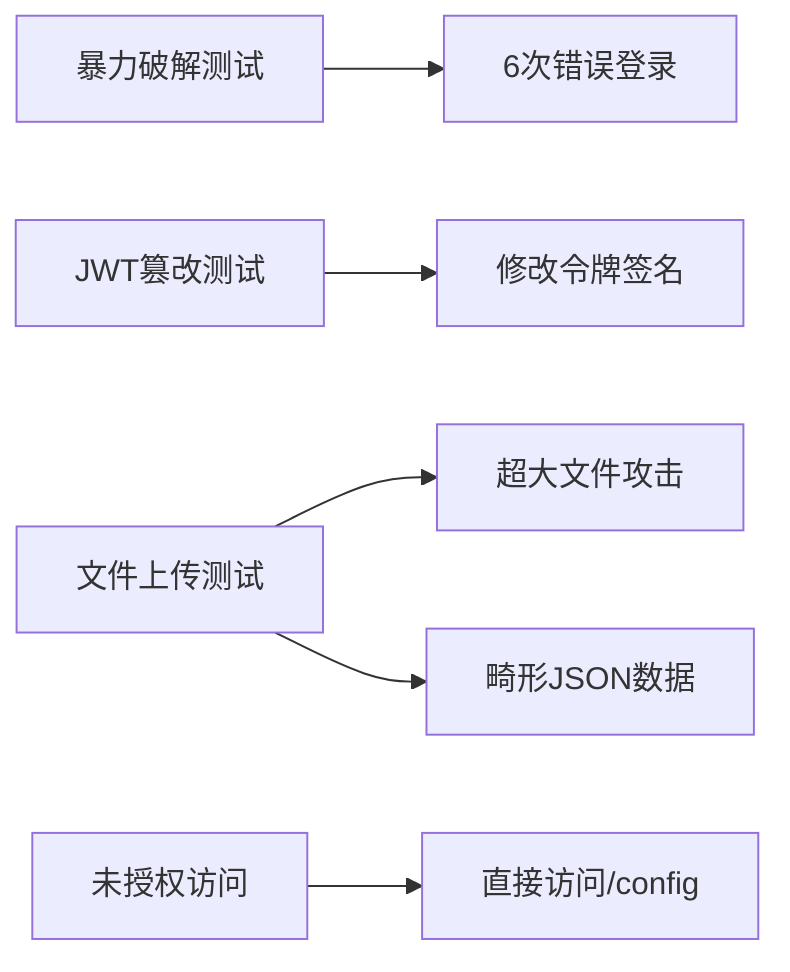

# 安全测试文档

## 测试方案
Catalyst 系统实现了以下安全防护机制：
1. **暴力破解防护**：5次登录失败后锁定账户
2. **JWT令牌验证**：防止令牌篡改
3. **文件上传防护**：
   - 请求体大小限制（2MB）
   - JSON格式验证
4. **端点授权检查**：敏感端点需认证

测试用例设计：


## 测试结果
### 暴力破解测试
```bash
尝试 1: {"error":"Invalid credentials"}
...
尝试 5: {"error":"Invalid credentials"}
尝试 6: {"error":"Too many attempts, try later"}
```
- ✅ 5次失败后返回429状态码
- ✅ 服务器日志记录攻击尝试

### JWT篡改测试
```bash
原始令牌: eyJhbGciOiJIUzI1NiIsInR5cCI6IkpXVCJ9...
篡改令牌: eyJhbGciOiJIUzI1NiIsInR5cCI6IkpXVCJ9...x

响应: 401 Unauthorized
```
- ✅ 篡改令牌被拒绝访问

### 文件上传测试
**超大文件攻击（2MB）**：
```bash
HTTP 413 Payload Too Large
```
**畸形JSON数据**：
```bash
HTTP 400 Bad Request
```
- ✅ 文件大小限制生效
- ✅ 畸形JSON被拒绝

### 未授权访问
```bash
GET /config/download → 401 Unauthorized
```
- ✅ 敏感端点需认证

## 使用指南
### 运行测试
```bash
./security_test.sh
```

### 结果解读
1. 检查各测试项是否返回预期状态码：
   - 429：暴力破解防护生效
   - 401：JWT验证生效
   - 413：文件大小限制生效
   - 400：JSON格式验证生效
2. 验证服务器日志记录：
   ```log
   [WARN] 登录失败尝试次数: 5
   [ERROR] 暴力破解防护触发: 账户锁定
   ```

### 自定义测试
修改脚本中的变量：
```bash
# 测试账号
TEST_USER="admin"
TEST_PASS="securePassword"

# 测试端点
AUTH_ENDPOINT="http://localhost:3000/auth/login"
CONFIG_ENDPOINT="http://localhost:3000/config/download"