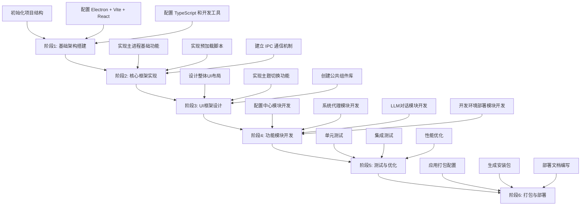

# Electron + Vite + React + TypeScript 桌面应用重构计划

## 1. 技术栈和关键依赖库推荐

### 核心框架
- **Electron**: 用于创建跨平台桌面应用
- **Vite**: 现代化前端构建工具，提供快速开发体验
- **React**: 用于构建用户界面
- **TypeScript**: 提供类型安全，增强代码可维护性

### UI 组件库
- **Ant Design**: 功能丰富的企业级 UI 组件库，支持主题定制
- **Styled Components**: CSS-in-JS 解决方案，便于组件样式管理

### 状态管理
- **Zustand**: 轻量级状态管理库，易于使用且功能强大

### 路由
- **React Router**: React 应用的标准路由库

### 数据持久化
- **electron-store**: 专门为 Electron 应用设计的简单数据持久化方案

### 系统交互
- **Node.js child_process**: 用于执行外部程序（如 mihomo-core.exe）
- **registry-js**: 用于修改 Windows 系统注册表

### 网络请求
- **Axios**: 功能丰富的 HTTP 客户端

### 开发工具
- **ESLint**: 代码质量检查工具
- **Prettier**: 代码格式化工具
- **Husky**: Git hooks 工具
- **lint-staged**: 对暂存文件运行 lint

### package.json 示例
```json
{
  "name": "electron-vite-react-app",
  "version": "1.0.0",
  "description": "Electron + Vite + React + TypeScript 桌面应用",
  "main": "dist/main/index.js",
  "scripts": {
    "dev": "vite",
    "build": "tsc && vite build",
    "preview": "vite preview",
    "electron:dev": " concurrently \"npm run dev\" \"wait-on http://localhost:5173 && electron .\"",
    "electron:build": "npm run build && electron-builder"
  },
  "dependencies": {
    "antd": "^5.0.0",
    "axios": "^1.0.0",
    "electron-store": "^8.0.0",
    "react": "^18.0.0",
    "react-dom": "^18.0.0",
    "react-router-dom": "^6.0.0",
    "registry-js": "^1.0.0",
    "styled-components": "^6.0.0",
    "zustand": "^4.0.0"
  },
  "devDependencies": {
    "@types/node": "^18.0.0",
    "@types/react": "^18.0.0",
    "@types/react-dom": "^18.0.0",
    "@types/styled-components": "^5.0.0",
    "@typescript-eslint/eslint-plugin": "^5.0.0",
    "@typescript-eslint/parser": "^5.0.0",
    "@vitejs/plugin-react": "^3.0.0",
    "concurrently": "^7.0.0",
    "electron": "^20.0.0",
    "electron-builder": "^23.0.0",
    "eslint": "^8.0.0",
    "eslint-config-prettier": "^8.0.0",
    "eslint-plugin-prettier": "^4.0.0",
    "eslint-plugin-react": "^7.0.0",
    "husky": "^8.0.0",
    "lint-staged": "^13.0.0",
    "prettier": "^2.0.0",
    "typescript": "^4.0.0",
    "vite": "^3.0.0",
    "wait-on": "^6.0.0"
  }
}
```

## 2. 项目目录结构设计

```tree
src/
├── main/                    # Electron 主进程代码
│   ├── index.ts             # 主进程入口文件
│   ├── tray.ts              # 系统托盘相关
│   ├── window.ts            # 窗口管理
│   └── ipcHandlers/         # IPC 处理函数
│       ├── config.ts        # 配置相关 IPC 处理
│       ├── proxy.ts         # 代理相关 IPC 处理
│       └── devEnv.ts        # 开发环境相关 IPC 处理
├── preload/                 # 预加载脚本
│   └── index.ts             # 预加载脚本入口
├── renderer/                # 渲染进程代码（React 应用）
│   ├── App.tsx              # 应用根组件
│   ├── main.tsx             # 渲染进程入口
│   ├── components/          # 公共组件
│   │   ├── Layout/          # 布局组件
│   │   ├── UI/              # UI 组件
│   │   └── Common/          # 通用组件
│   ├── pages/               # 页面组件
│   │   ├── Dashboard/       # 仪表板页面
│   │   ├── ConfigCenter/    # 配置中心页面
│   │   ├── ProxyManager/    # 代理管理页面
│   │   ├── LLMChat/         # LLM 对话页面
│   │   └── DevEnvSetup/     # 开发环境设置页面
│   ├── store/               # 状态管理
│   │   ├── index.ts         # store 入口
│   │   ├── configStore.ts   # 配置状态
│   │   ├── proxyStore.ts    # 代理状态
│   │   └── themeStore.ts    # 主题状态
│   ├── hooks/               # 自定义 hooks
│   ├── utils/               # 工具函数
│   ├── services/            # 业务逻辑层
│   │   ├── configService.ts # 配置服务
│   │   ├── proxyService.ts  # 代理服务
│   │   ├── llmService.ts    # LLM 服务
│   │   └── devEnvService.ts # 开发环境服务
│   ├── assets/              # 静态资源
│   │   ├── icons/           # 图标
│   │   ├── images/          # 图片
│   │   └── styles/          # 全局样式
│   └── routes/              # 路由配置
│       └── index.tsx        # 路由定义
├── shared/                  # 主进程和渲染进程共享代码
│   ├── types/               # 共享类型定义
│   ├── constants/           # 共享常量
│   └── utils/               # 共享工具函数
├── resources/               # 应用资源文件
│   └── mihomo-core.exe      # 代理核心程序
└── tests/                   # 测试文件
    ├── unit/                # 单元测试
    └── integration/         # 集成测试
```

## 3. 核心功能模块化方案

### 3.1 配置中心模块
**功能描述**: 支持JSON导入/导出，持久化存储用户配置（VPN URL, LLM API Keys）

**技术实现**:
- 使用 `electron-store` 进行本地数据持久化
- 提供导入/导出 JSON 文件的功能
- 实现配置的增删改查操作
- 通过 IPC 机制在主进程和渲染进程间通信

**模块划分**:
- `configService.ts`: 配置业务逻辑处理
- `configStore.ts`: 配置状态管理
- `ipcHandlers/config.ts`: IPC 处理函数
- `ConfigCenterPage`: 配置中心页面组件

### 3.2 现代化UI模块
**功能描述**: 右侧导航菜单，左侧内容，圆角阴影，支持明/暗色主题切换

**技术实现**:
- 使用 Ant Design 组件库构建界面
- 使用 Styled Components 实现自定义样式
- 实现主题切换功能，支持明/暗色主题
- 使用 Zustand 管理主题状态

**模块划分**:
- `themeStore.ts`: 主题状态管理
- `Layout/`: 布局组件（侧边栏、顶部栏等）
- `UI/`: UI 组件（按钮、表单等）
- `styles/`: 全局样式和主题变量

### 3.3 系统代理模块
**功能描述**: 调用外部 mihomo-core.exe，实现TUN模式，管理代理组，修改Windows系统代理

**技术实现**:
- 使用 Node.js 的 `child_process` 模块启动和控制 mihomo-core.exe
- 通过 IPC 与主进程通信，控制代理状态
- 使用 `registry-js` 修改 Windows 系统代理设置
- 实现代理配置的管理功能

**模块划分**:
- `proxyService.ts`: 代理业务逻辑处理
- `proxyStore.ts`: 代理状态管理
- `ipcHandlers/proxy.ts`: IPC 处理函数
- `ProxyManagerPage`: 代理管理页面组件

### 3.4 LLM 对话模块
**功能描述**: 类似Google AI Studio界面，带参数设置和模型切换

**技术实现**:
- 实现聊天界面，支持消息展示和输入
- 提供参数设置面板，可配置温度、最大token等参数
- 支持多种模型切换功能
- 使用 Axios 发送 API 请求到 LLM 服务

**模块划分**:
- `llmService.ts`: LLM 业务逻辑处理
- `LLMChatPage`: LLM 对话页面组件
- `ChatPanel`: 聊天面板组件
- `ParameterPanel`: 参数设置面板组件

### 3.5 开发环境部署模块
**功能描述**: 通过调用Winget或Chocolatey脚本，一键安装IDE和开发环境

**技术实现**:
- 检测系统中是否已安装 Winget 或 Chocolatey
- 提供可选的开发工具列表（VS Code, Node.js, Python等）
- 使用 `child_process` 执行安装命令
- 显示安装进度和结果

**模块划分**:
- `devEnvService.ts`: 开发环境业务逻辑处理
- `ipcHandlers/devEnv.ts`: IPC 处理函数
- `DevEnvSetupPage`: 开发环境设置页面组件
- `ToolList`: 工具列表组件

## 4. 重构执行步骤路线图



### 阶段1: 基础架构搭建 (1-2周)
1. 初始化项目结构，创建目录和基础文件
2. 配置 Electron + Vite + React + TypeScript 环境
3. 配置 ESLint、Prettier 等开发工具
4. 配置 husky 和 lint-staged

### 阶段2: 核心框架实现 (2-3周)
1. 实现 Electron 主进程基础功能
2. 实现预加载脚本，建立安全的进程间通信
3. 建立 IPC 通信机制
4. 实现基础的窗口管理和系统托盘功能

### 阶段3: UI框架设计 (2-3周)
1. 设计整体UI布局（右侧导航菜单，左侧内容）
2. 实现主题切换功能，支持明/暗色主题
3. 创建公共组件库
4. 实现基础页面框架

### 阶段4: 功能模块开发 (4-6周)
1. 配置中心模块开发
   - 实现配置的增删改查
   - 实现JSON导入/导出功能
   - 实现数据持久化存储

2. 系统代理模块开发
   - 实现 mihomo-core.exe 的调用和控制
   - 实现TUN模式配置
   - 实现代理组管理
   - 实现Windows系统代理修改

3. LLM对话模块开发
   - 实现聊天界面
   - 实现参数设置功能
   - 实现模型切换功能
   - 实现与LLM API的交互

4. 开发环境部署模块开发
   - 实现 Winget/Chocolatey 检测
   - 实现开发工具一键安装
   - 实现安装进度显示

### 阶段5: 测试与优化 (2-3周)
1. 编写单元测试
2. 进行集成测试
3. 性能优化和bug修复
4. 用户体验优化

### 阶段6: 打包与部署 (1周)
1. 配置应用打包参数
2. 生成 Windows 安装包
3. 编写部署文档
4. 进行最终测试

## 总结

本重构计划为 Electron + Vite + React + TypeScript 桌面应用提供了完整的架构设计和实施路线图。通过模块化的设计和清晰的实施步骤，可以确保项目在重构过程中保持良好的可维护性和可扩展性。重点关注代码质量、用户体验和系统稳定性，将有助于打造一个高质量的桌面应用程序。