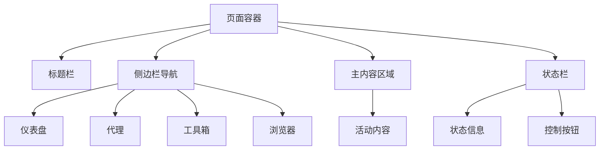
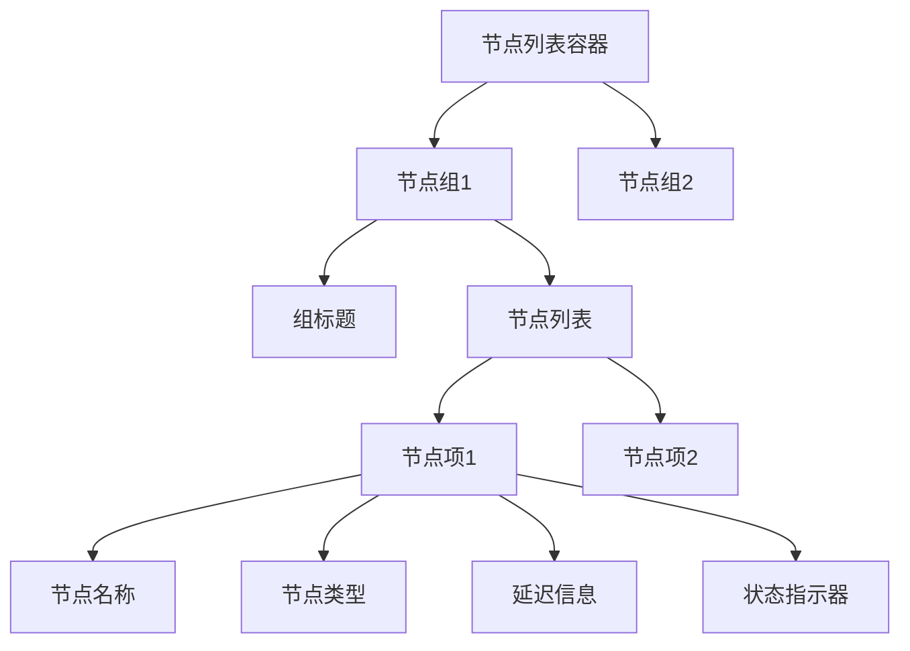
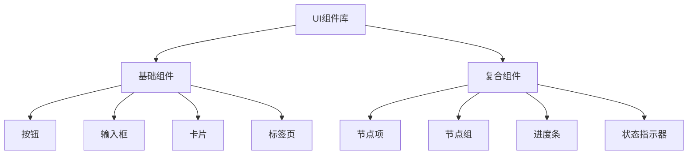

# Index页面重构与美化计划

## 概述

本文档详细描述了对Catalyst应用的index页面进行重构和美化的计划。目标是改进页面的视觉设计，优化用户体验，并更好地展示代理节点信息。

## 当前问题分析

1. **布局问题**：
   - 标题栏和状态栏占据过多垂直空间
   - 标签页导航与内容分离，不够直观
   - 整体布局缺乏现代感

2. **代理节点展示问题**：
   - 节点信息展示简单，缺乏关键信息
   - 节点切换交互不够直观
   - 缺乏节点状态的可视化展示

3. **UI组件问题**：
   - 组件样式基础，缺乏现代感
   - 交互反馈不够丰富
   - 缺乏一致的视觉语言

## 新设计规划

### 1. 页面布局重构

#### 新布局特点：
- 采用侧边栏导航替代顶部标签页
- 紧凑型标题栏设计
- 响应式内容区域

#### 布局结构图：

### 2. 代理节点展示改进

#### 新节点展示特点：
- 节点组使用可折叠面板展示
- 增加节点类型、延迟等信息
- 使用颜色编码显示节点状态
- 提供搜索和过滤功能

#### 节点展示结构图：

### 3. 现代化UI组件设计

#### 新组件规范：
- **按钮组件**：增加多种样式变体（主按钮、次按钮、警告按钮、文本按钮）
- **卡片组件**：增加阴影、圆角等现代设计元素
- **表单组件**：改进输入框、下拉框等的样式
- **进度条组件**：设计更美观的进度展示方式

#### 组件层次结构图：

### 4. 全局样式更新

#### 颜色系统扩展：
- 主色调：`#4d6df3`（保持不变）
- 成功色：`#00c9a7`
- 警告色：`#ffac1e`
- 错误色：`#ff5a87`
- 信息色：`#17a2b8`
- 中性色：一系列灰度颜色

#### 字体和排版系统：
- 主字体：`"Exo 2", sans-serif`（保持不变）
- 标题层级：h1-h4，定义清晰的字体大小和行高
- 正文：定义合适的字体大小和行高

#### 间距系统：
- 基础单位：`8px`
- 间距比例：`8px, 16px, 24px, 32px, 40px, 48px`

## 实现步骤

### 第一阶段：页面布局重构
1. 修改`index.html`结构，实现侧边栏导航
2. 更新CSS样式，实现新的布局
3. 调整JavaScript交互逻辑

### 第二阶段：代理节点展示改进
1. 修改`ClashPanel`组件，实现新的节点展示方式
2. 添加节点搜索和过滤功能
3. 实现节点状态的可视化展示

### 第三阶段：UI组件现代化
1. 创建新的CSS类，实现现代化组件样式
2. 更新现有组件的样式
3. 添加新的组件样式

### 第四阶段：全局样式更新
1. 修改`global.css`文件
2. 确保所有组件都能正确使用新的样式系统
3. 添加响应式设计支持

## 测试计划

### 功能测试
- 确保所有现有功能正常工作
- 测试新的交互功能
- 验证代理节点切换功能

### 视觉测试
- 检查所有组件的视觉效果
- 确保在不同屏幕尺寸下的显示效果
- 验证颜色和字体的一致性

### 用户体验测试
- 验证交互反馈是否清晰
- 检查页面加载和响应速度
- 确保操作流程符合用户预期

## 预期效果

通过本次重构和美化，预期将达到以下效果：
1. 页面视觉效果更加现代化和美观
2. 代理节点信息展示更加直观和丰富
3. 用户操作体验更加流畅和便捷
4. 整体界面的一致性和可用性得到提升